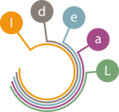

<a id="readme-top"></a>

<!-- PROJECT SHIELDS -->
<!-- [![Contributors][contributors-shield]][contributors-url] -->
<!-- [![Forks][forks-shield]][forks-url] -->
<!-- [![Stargazers][stars-shield]][stars-url] -->
<!-- [![Issues][issues-shield]][issues-url] -->
[![License][license-shield]][license-url]
[![LinkedIn][linkedin-shield]][linkedin-url]


<br />
<div align="center">
<!-- PROJECT LOGO -->
  <a href="https://www.oth-aw.de/forschung/forschungsprofil/forschungs-und-entwicklungsprojekte/ideal/">
    
  </a>

<h3 align="center">Translation Tool</h3>

  <p align="center">
    A web-based tool for translating XML and MBZ files, optimized for Moodle content.
    <br />
    <a href="https://git.oth-aw.de/b566/translation-tool"><strong>Explore the docs »</strong></a>
    <br />
    <br />
    <a href="https://git.oth-aw.de/b566/translation-tool">View Demo</a>
    ·
    <a href="https://git.oth-aw.de/b566/translation-tool/issues/new?labels=bug">Report Bug</a>
    ·
    <a href="https://git.oth-aw.de/b566/translation-tool/issues/new?labels=enhancement">Request Feature</a>
  </p>
</div>

<!-- TABLE OF CONTENTS -->
<details>
  <summary>Table of Contents</summary>
  <ol>
    <li><a href="#about-the-project">About The Project</a></li>
    <li><a href="#built-with">Built With</a></li>
    <li><a href="#getting-started">Getting Started</a></li>
    <li><a href="#usage">Usage</a></li>
    <li><a href="#roadmap">Roadmap</a></li>
    <li><a href="#contributing">Contributing</a></li>
    <li><a href="#license">License</a></li>
    <li><a href="#contact">Contact</a></li>
  </ol>
</details>

## About The Project

A simple and powerful Flask-based app for translating XML and MBZ files via LibreTranslate API. Built with production readiness in mind using Docker.

<p align="right">(<a href="#readme-top">back to top</a>)</p>

## Built With

### Built With

[![Docker][Docker]][Docker-url]
[![LibreTranslate][LibreTranslate]][LibreTranslate-url]
[![FLASK][FLASK]][Flask-url]
[![Flask-SocketIO][Flask-SocketIO]][Flask-SocketIO-url]
[![eventlet][eventlet]][eventlet-url]
[![Bootstrap][Bootstrap]][Bootstrap-url]

<p align="right">(<a href="#readme-top">back to top</a>)</p>

## Getting Started

### Prerequisites

- Docker
- Docker Compose
- WSL2 (on Windows, required for Docker Desktop)

### Installation

Clone the repository:

```bash
git clone https://git.oth-aw.de/b566/translation-tool
cd translation-tool
```

Then start the container:

```bash
docker compose up --build -d
```

Development mode:

```bash
docker compose -f docker-compose.dev.yml up --build -d
```

> `--build` ensures a fresh build. `-d` runs it in detached mode.

### Environment Configuration

You can limit which language models LibreTranslate loads by setting the `LT_LOAD_ONLY` variable in `env/prod.env` or `env/dev.env`:

```env
LT_LOAD_ONLY=de,en
```

> ⚠️ If you do **not** set `LT_LOAD_ONLY`, **all models will be loaded**.  
> This slows down the **very first container startup after a fresh build**, as all models are downloaded and initialized.  
> **After the first startup, the models are cached and subsequent starts are much faster.**

<p align="right">(<a href="#readme-top">back to top</a>)</p>

## Usage

Once the containers are running:

- Visit [http://localhost](http://localhost) in your browser
- Or open Docker Desktop and click on the mapped port (usually `80:5000`)

<p align="right">(<a href="#readme-top">back to top</a>)</p>

## Roadmap

- [X] Upload progress bar
- [ ] Drag & Drop upload UI
- [ ] Persistent translation history
- [ ] User authentication
- [ ] Glossary / translation memory

<p align="right">(<a href="#readme-top">back to top</a>)</p>

## Contributing

1. Fork the repository
2. Create your feature branch (`git checkout -b feature/AmazingFeature`)
3. Commit your changes (`git commit -m 'Add some AmazingFeature'`)
4. Push to the branch (`git push origin feature/AmazingFeature`)
5. Open a pull request

<p align="right">(<a href="#readme-top">back to top</a>)</p>

## License

Distributed under the MIT License. See `LICENSE` for more information.

<p align="right">(<a href="#readme-top">back to top</a>)</p>

## Contact

Wolfgang Weigl – [LinkedIn](https://linkedin.com/in/wolfgang-weigl-933885236/)  
Project Website: [Projekt IdeaL | OTH Amberg-Weiden](https://www.oth-aw.de/forschung/forschungsprofil/forschungs-und-entwicklungsprojekte/ideal/)
Repository: [https://git.oth-aw.de/b566/translation-tool](https://git.oth-aw.de/b566/translation-tool)


<p align="right">(<a href="#readme-top">back to top</a>)</p>

<!-- MARKDOWN LINKS & IMAGES -->
<!-- [contributors-shield]: https://img.shields.io/github/contributors/b566/translation-tool.svg?style=for-the-badge -->
<!-- [contributors-url]: https://git.oth-aw.de/b566/translation-tool/graphs/contributors -->
<!-- [forks-shield]: https://img.shields.io/github/forks/b566/translation-tool.svg?style=for-the-badge -->
<!-- [forks-url]: https://git.oth-aw.de/b566/translation-tool/network/members -->
<!-- [stars-shield]: https://img.shields.io/github/stars/b566/translation-tool.svg?style=for-the-badge -->
<!-- [stars-url]: https://git.oth-aw.de/b566/translation-tool/stargazers -->
<!-- [issues-shield]: https://img.shields.io/github/issues/b566/translation-tool.svg?style=for-the-badge -->
<!-- [issues-url]: https://git.oth-aw.de/b566/translation-tool/issues -->
[license-shield]: https://img.shields.io/badge/license-MIT-blue?style=for-the-badge
[license-url]: https://git.oth-aw.de/b566/translation-tool/blob/main/LICENSE
[linkedin-shield]: https://img.shields.io/badge/-LinkedIn-black.svg?style=for-the-badge&colorB=0a66c2
[linkedin-url]: https://linkedin.com/in/wolfgang-weigl-933885236/
[Docker]: https://img.shields.io/badge/docker-257bd6?style=for-the-badge&logo=docker&logoColor=white
[Docker-url]: https://www.docker.com/
[LibreTranslate]: https://img.shields.io/badge/libretranslate-555?style=for-the-badge
[LibreTranslate-url]: https://github.com/LibreTranslate/LibreTranslate
[FLASK]: https://img.shields.io/badge/Flask-000000?style=for-the-badge&logo=Flask&logoColor=white
[Flask-url]: https://flask.palletsprojects.com/
[Flask-SocketIO]: https://img.shields.io/badge/Socket.io-4.1.3-010101?style=for-the-badge&logo=Socket.io&logoColor=white
[Flask-SocketIO-url]: https://flask-socketio.readthedocs.io/
[eventlet]: https://img.shields.io/badge/eventlet-555?style=for-the-badge
[eventlet-url]: https://pypi.org/project/eventlet/
[Bootstrap]: https://img.shields.io/badge/Bootstrap-563D7C?style=for-the-badge&logo=bootstrap&logoColor=white
[Bootstrap-url]: https://getbootstrap.com/